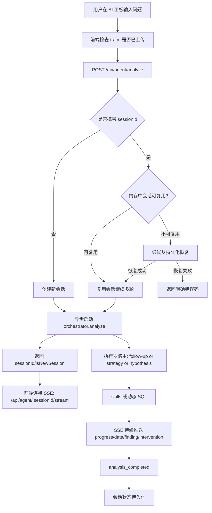

# SmartPerfetto 完整流程图（AgentRuntime 主链）

> 更新日期：2026-02-26
> 适用范围：`backend/src/routes/agentRoutes.ts` + `backend/src/agentv2/runtime/agentRuntime.ts` + `perfetto/ui/src/plugins/com.smartperfetto.AIAssistant/*`

---

## 0. 核心结论

当前系统是单主链“带 UI 的智能助手”架构：

- 统一入口：`/api/agent/*`
- 统一编排：`AgentRuntime`
- 统一输出：SSE 事件流 + 结构化 DataEnvelope
- 兼容层隔离：`/api/ai/*`、`/api/auto-analysis/*` 默认返回 `410 LEGACY_ROUTE_DEPRECATED`

---

## 1. 端到端主流程



---

## 2. Frontend 交互阶段

### 2.1 发送分析请求

前端主入口（`ai_panel.ts`）发送：

```json
{
  "query": "分析滑动卡顿",
  "traceId": "trace-uuid",
  "sessionId": "agent-...",
  "options": {
    "maxRounds": 3,
    "confidenceThreshold": 0.5,
    "maxNoProgressRounds": 2,
    "maxFailureRounds": 2
  }
}
```

说明：
- `sessionId` 可选；用于续聊同一 trace。
- 请求成功后返回 `sessionId`，前端再连接 SSE。

### 2.2 会话连续性检查

前端会在多轮前尝试 `POST /api/agent/resume`（若已有 sessionId）。

- 若会话不可恢复，会清理本地旧 sessionId 并走新会话。
- 若恢复成功，后续请求复用同一个 `sessionId`。

---

## 3. Backend 请求受理阶段

### 3.1 `POST /api/agent/analyze`

路由层行为：

1. 校验 `traceId`、`query`
2. 校验 trace 是否已上传
3. 处理 `sessionId` 续聊/恢复语义
4. 启动异步分析 promise
5. 立即返回 `sessionId` 与 `isNewSession`

典型成功响应：

```json
{
  "success": true,
  "sessionId": "agent-1772...",
  "message": "Analysis started",
  "isNewSession": true,
  "architecture": "agent-driven"
}
```

### 3.2 指定 `sessionId` 时的严格语义

不再 silent fallback 新会话，改为显式成功或显式失败：

- `409 SESSION_BUSY`：会话仍在运行
- `400 TRACE_ID_MISMATCH`：请求 trace 与会话 trace 不一致
- `404 SESSION_NOT_FOUND`：会话不存在
- `409 SESSION_CONTEXT_MISSING`：会话元数据存在但上下文快照缺失
- `503 SESSION_PERSISTENCE_UNAVAILABLE`：持久化层不可用

仅当请求未带 `sessionId` 时才创建新会话。

---

## 4. 编排执行阶段（AgentRuntime）

### 4.1 执行器选择优先级

1. follow-up 执行器
   - `clarify`
   - `compare`
   - `extend`
   - `drill_down`
2. strategy 命中时走 `StrategyExecutor`（可按 manifest 策略偏好回退 hypothesis）
3. 未命中策略时走 `HypothesisExecutor`

### 4.2 执行中事件流

SSE 常见事件：

- `connected`
- `progress`
- `data`
- `finding`
- `focus_updated`
- `intervention_required`
- `intervention_resolved`
- `degraded`
- `analysis_completed`
- `error`
- `end`

---

## 5. 会话恢复与持久化

### 5.1 写入时机

分析完成后，无论成功或失败，都会尝试持久化：

- session metadata
- `EnhancedSessionContext`
- `FocusStore`
- `TraceAgentState`

### 5.2 恢复结果构建

恢复时使用最后一个完成 turn 构造 `recoveredResult`：

- `rounds` = 完成轮次
- `totalDurationMs` = 已完成 turns 执行时长累加

这保证恢复后的统计信息与历史执行一致。

### 5.3 会话发现与恢复 API

- `GET /api/agent/sessions`：返回 active + recoverable sessions
- `POST /api/agent/resume`：把 recoverable session 重新激活到内存

---

## 6. 场景还原子流程（独立）

场景还原走专用接口，不和 analyze 混用：

- `POST /api/agent/scene-reconstruct`
- `GET /api/agent/scene-reconstruct/:analysisId/stream`

另外，`/api/agent/analyze` 会拒绝“纯场景还原”关键词请求并返回指引，避免路径混淆。

---

## 7. Legacy 兼容层策略

### 7.1 默认行为

- `/api/ai/*` -> `410 LEGACY_ROUTE_DEPRECATED`
- `/api/auto-analysis/*` -> `410 LEGACY_ROUTE_DEPRECATED`

响应中会给出替代入口：`POST /api/agent/analyze`。

### 7.2 可选启用（仅灰度/迁移）

- `FEATURE_ENABLE_LEGACY_AI_ROUTES=true`
- `FEATURE_ENABLE_LEGACY_AUTO_ANALYSIS_ROUTES=true`

默认关闭，且 legacy router 仅在开启时运行时加载。

### 7.3 防回流门禁

CI 会执行：

- `npm run check:legacy-routes`

用于阻止新代码继续引入 `/api/ai`、`/api/auto-analysis` 调用。

---

## 8. 最小调用序列（客户端）

```text
1) 上传 trace -> 拿到 traceId
2) POST /api/agent/analyze (query + traceId + 可选 sessionId)
3) 从响应拿 sessionId
4) GET /api/agent/{sessionId}/stream 监听实时事件
5) 如需续聊：下一轮继续带同一 sessionId
6) 如进程重启后续聊：先 POST /api/agent/resume，再继续 analyze
```

---

## 9. 快速排障

- 收到 `TRACE_NOT_UPLOADED`：先重新上传 trace。
- 收到 `SESSION_NOT_FOUND`：使用 `/api/agent/sessions` 选择可恢复会话，或不带 `sessionId` 新开。
- 收到 `SESSION_CONTEXT_MISSING`：该 session 不可恢复，需新开。
- 收到 `SESSION_BUSY`：等待当前轮结束，或使用新会话。
- legacy 路径返回 `410`：说明兼容层未开启，按迁移提示切到 `/api/agent/analyze`。
