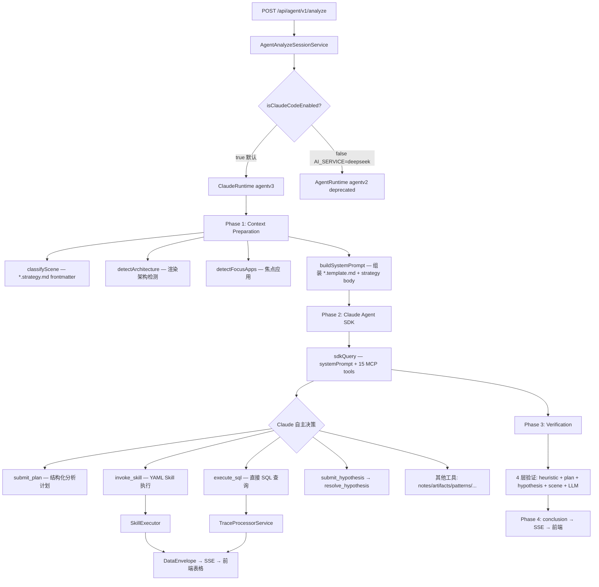
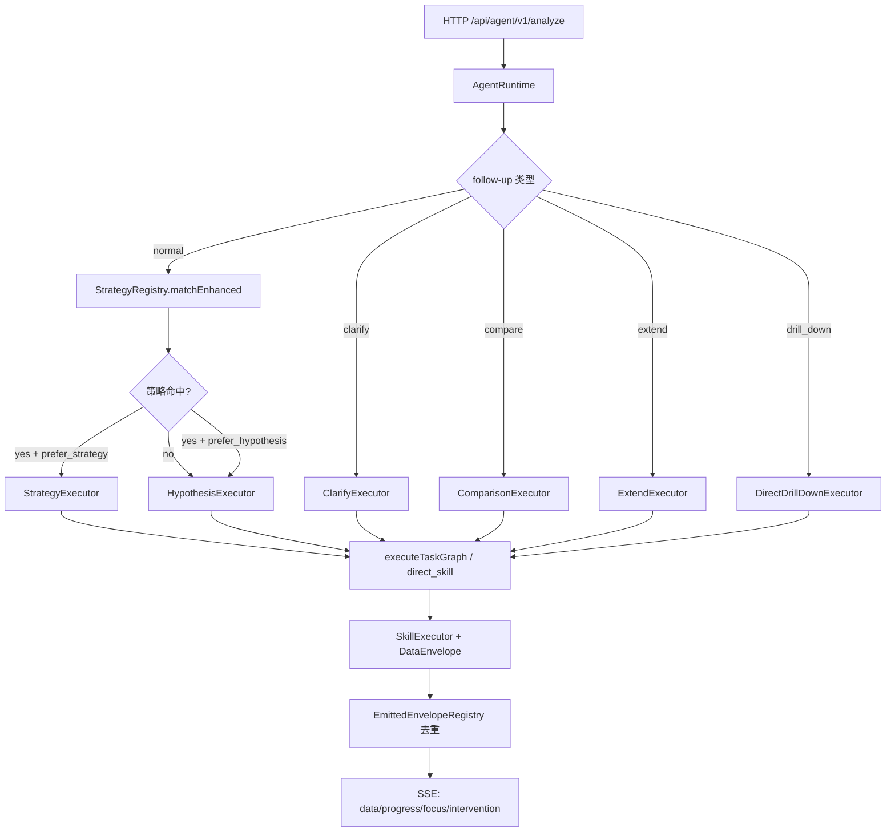

# SmartPerfetto 架构深度分析（与代码对齐）

> 更新日期：2026-03-12
> 范围：以当前 `backend/src/agentv3/`（Claude Agent SDK）主链路为准，保留 agentv2 legacy 文档供参考。

本目录用于沉淀”可维护、可落地”的架构深度文档。

- **agentv3（当前主链路）**：Claude Agent SDK 作为编排器，通过 MCP 工具自主分析
- **agentv2（已弃用）**：governance pipeline + 多执行器，仅在 `AI_SERVICE=deepseek` 时激活

---

## 文档索引

### agentv3（当前主链路）

| 文档 | 关注点 | 对应核心代码 |
|------|--------|--------------|
| [08-agentv3-content-system.md](./08-agentv3-content-system.md) | **内容体系**：Strategy MD + Skill YAML 双轨数据流 | `backend/src/agentv3/strategyLoader.ts`, `claudeSystemPrompt.ts`, `claudeMcpServer.ts` |

### agentv2（已弃用 — 仅供参考）

> 以下文档描述的是 agentv2 架构（`AI_SERVICE=deepseek` 时激活）。当前默认主链路已切换至 agentv3（Claude Agent SDK）。agentv2 中的 Strategy/Domain Agents/Decision Trees 等机制在 agentv3 中由 Claude 自主推理 + MCP 工具替代。

| 文档 | 关注点 | 对应核心代码 |
|------|--------|--------------|
| [01-agent-runtime.md](./01-agent-runtime.md) | ~~Runtime（薄协调层）与执行器路由~~ → v3: `claudeRuntime.ts` | `backend/src/agentv2/runtime/agentRuntime.ts` |
| [02-multi-round-conversation.md](./02-multi-round-conversation.md) | ~~多轮对话：follow-up、实体引用~~ → v3: SDK `resume` + `entityStore` | `backend/src/agent/context/enhancedSessionContext.ts` |
| [03-memory-state-management.md](./03-memory-state-management.md) | ~~Memory：短期/长期、证据摘要~~ → v3: `analysisPatternMemory` + `analysisNotes` | `backend/src/agent/state/traceAgentState.ts` |
| [04-strategy-system.md](./04-strategy-system.md) | ~~Strategy：确定性流水线~~ → v3: `.strategy.md` 注入 system prompt | `backend/src/agent/strategies/*` |
| [05-domain-agents.md](./05-domain-agents.md) | ~~Domain Agents：Think-Act-Reflect~~ → v3: Claude 自主调用 MCP 工具 | `backend/src/agent/agents/*` |
| [06-scrolling-startup-optimization.md](./06-scrolling-startup-optimization.md) | ~~Scrolling/Startup 确定性链路~~ → v3: 场景策略 + Claude 自主编排 | `backend/src/agent/strategies/*` |
| [07-domain-extensibility-refactor.md](./07-domain-extensibility-refactor.md) | ~~领域可扩展性重构蓝图~~ → v3: Skill YAML + MCP 自动发现 | `backend/src/agent/config/*` |

---

## 一句话结论

SmartPerfetto 的架构已从 agentv2 的”代码强制 pipeline + LLM 胶水”演进为 agentv3 的”Claude 自主推理 + MCP 工具”：

- **agentv2**：代码控制 → StrategyExecutor/HypothesisExecutor → Domain Agents → SkillExecutor
- **agentv3**：内容控制 → `.strategy.md` 指导思考 + `.skill.yaml` 提供能力 → Claude 自主编排

---

## 架构总览（agentv3 — 当前真实运行路径）

### 关键设计要点（2026-03-12）

**双轨内容驱动：**
- `.strategy.md` → System Prompt（告诉 Claude 怎么分析）
- `.skill.yaml` → MCP invoke_skill（Claude 用来查数据）
- 新增场景/技能 = 新增文件，零代码改动

**Claude 自主性保障：**
- `submit_plan` 必须首先调用（代码强制，非 prompt 建议）
- `submit_hypothesis` / `resolve_hypothesis` — 假设驱动分析
- `flag_uncertainty` — 非阻塞标记不确定性
- Circuit Breaker — 工具连续失败时自动收窄分析范围

**跨会话学习：**
- `analysisPatternMemory` — 正面/负面模式（频率加权, 30 天半衰期）
- `recall_patterns` MCP 工具 — Claude 主动查询历史经验
- Learned misdiagnosis patterns — 自动从验证失败中提取

**多轮对话：**
- SDK `resume: sdkSessionId` 自动恢复上下文
- `entityStore` 跨轮次实体追踪（”第3帧” → frameId）
- `analysisNotes` 磁盘持久化（跨重启存活）

---

## agentv2 架构总览（已弃用 — 仅供参考）

展开 agentv2 架构图

---

## 模块清单（与代码对齐）

### agentv3 Runtime（15 source files — 当前主链路）

| 文件 | 职责 |
|------|------|
| claudeRuntime.ts | 主编排器 — implements `IOrchestrator`, wraps `sdkQuery()` |
| claudeMcpServer.ts | 15 MCP tools — Claude 通过这些工具访问 trace 数据 |
| claudeSystemPrompt.ts | 动态 system prompt — 按 SceneType 注入分析策略 |
| strategyLoader.ts | 加载 `*.strategy.md` / `*.template.md` — frontmatter 解析 + 变量替换 |
| sceneClassifier.ts | 场景分类 — keywords 来自 strategy.md frontmatter (<1ms) |
| claudeSseBridge.ts | SDK stream → SSE events 桥接 |
| claudeConfig.ts | 配置 + `isClaudeCodeEnabled()` 路由判断 |
| focusAppDetector.ts | 焦点应用检测 (battery_stats/oom_adj/frame_timeline) |
| claudeVerifier.ts | 4 层验证 (heuristic + plan + hypothesis + scene + LLM) |
| claudeAgentDefinitions.ts | Sub-agent 定义 (feature-flagged) |
| artifactStore.ts | Skill 结果引用存储 — 3 级获取 (summary/rows/full) |
| sqlSummarizer.ts | SQL 结果摘要 — 节省 ~85% tokens |
| claudeFindingExtractor.ts | 从 SDK 响应和 Skill 结果中提取 Findings |
| analysisPatternMemory.ts | 跨会话分析模式记忆 (200 条, 频率加权, 60 天 TTL) |
| types.ts | ClaudeAnalysisContext, AnalysisPlanV3, Hypothesis, etc. |

### Shared Components（agentv3 + agentv2 共用）

| 组件 | 位置 | 说明 |
|------|------|------|
| Detectors | `agent/detectors/` | 架构检测 (Standard/Flutter/Compose/WebView) |
| EntityStore | `agent/context/entityStore.ts` | 跨轮次实体追踪 |
| EntityCapture | `agent/core/entityCapture.ts` | 从分析结果中提取实体 |
| ConclusionGenerator | `agent/core/conclusionGenerator.ts` | 结论综合与格式化 |
| Decision Trees | `agent/decision/trees/` | 滑动/启动决策树 (agentv2 使用, agentv3 中由 Claude 推理替代) |
| Experts | `agent/experts/` | 领域专家 (agentv2 使用, agentv3 中由 Claude 替代) |

### Key Services

| Service | 位置 | 说明 |
|---------|------|------|
| TraceProcessorService | services/traceProcessorService.ts | HTTP RPC 查询 (端口池 9100-9900) |
| SkillExecutor | services/skillEngine/skillExecutor.ts | YAML Skill 引擎 — agentv3 通过 MCP invoke_skill 调用 |
| SkillLoader | services/skillEngine/skillLoader.ts | Skill 加载器 — 启动时扫描 `backend/skills/` |
| PipelineSkillLoader | services/pipelineSkillLoader.ts | Pipeline Skill 加载器 (含 Teaching) |
| SkillAnalysisAdapter | services/skillEngine/skillAnalysisAdapter.ts | Skill 分析适配 — list_skills MCP 工具使用 |
| SessionLogger | services/sessionLogger.ts | JSONL 会话日志 |
| HTMLReportGenerator | services/htmlReportGenerator.ts | HTML 报告生成 |

### Content Files

| 类别 | 数量 | 位置 | 用途 |
|------|------|------|------|
| Strategy MD | 6 | `backend/strategies/*.strategy.md` | 场景分析策略 → system prompt |
| Template MD | 8 | `backend/strategies/*.template.md` | 提示词模板 → system prompt |
| SOP MD | 9 | `backend/skills/docs/*.sop.md` | 参考文档（未自动注入） |
| Atomic Skills | 57 | `backend/skills/atomic/` | 单步 SQL 查询 |
| Composite Skills | 28 | `backend/skills/composite/` | 多步组合分析 |
| Pipeline Skills | 26 | `backend/skills/pipelines/` | 渲染管线检测+教学 |
| Deep Skills | 2 | `backend/skills/deep/` | 深度分析 |
| Module Skills | 18 | `backend/skills/modules/` | 模块配置 |
| Vendor Skills | 8 | `backend/skills/vendors/` | 厂商适配 |

### Frontend Plugin

位置：`perfetto/ui/src/plugins/com.smartperfetto.AIAssistant/`

| 文件 | 说明 |
|------|------|
| ai_panel.ts | 主 UI（含 Mermaid 渲染） |
| ai_service.ts | 后端通信 |
| sql_result_table.ts | 数据表格（schema-driven by ColumnDefinition） |
| chart_visualizer.ts | 图表可视化 |
| sse_event_handlers.ts | SSE 事件处理 |
| navigation_bookmark_bar.ts | 导航书签 |

展开 agentv2 详细模块清单（已弃用）

#### Agent Core (`backend/src/agent/core/`)

agentRuntime.ts, orchestratorTypes.ts, circuitBreaker.ts, modelRouter.ts, stateMachine.ts, intentUnderstanding.ts, hypothesisGenerator.ts, conclusionGenerator.ts, conclusionSceneTemplates.ts, sceneRouter.ts, scenePolicy.ts, sceneTemplateStore.ts, sceneTemplateValidator.ts, feedbackSynthesizer.ts, followUpHandler.ts, pipelineExecutor.ts, taskGraphPlanner.ts, taskGraphExecutor.ts, drillDownResolver.ts, entityCapture.ts, strategySelector.ts, interventionController.ts, incrementalAnalyzer.ts, jankCauseSummarizer.ts, emittedEnvelopeRegistry.ts

#### Executors (`backend/src/agent/core/executors/`)

strategyExecutor.ts, hypothesisExecutor.ts, directSkillExecutor.ts, clarifyExecutor.ts, comparisonExecutor.ts, extendExecutor.ts, directDrillDownExecutor.ts, traceConfigDetector.ts, analysisExecutor.ts

#### Domain Agents (`backend/src/agent/agents/domain/`)

frameAgent.ts, cpuAgent.ts, memoryAgent.ts, binderAgent.ts, additionalAgents.ts (Startup/Interaction/ANR/System)

#### Strategies (`backend/src/agent/strategies/`)

scrollingStrategy.ts (3 阶段流水线), startupStrategy.ts (3 阶段流水线), sceneReconstructionStrategy.ts, registry.ts, helpers.ts

#### Decision Trees (`backend/src/agent/decision/trees/`)

scrollingDecisionTree.ts, launchDecisionTree.ts

#### Experts (`backend/src/agent/experts/`)

launchExpert.ts, interactionExpert.ts, systemExpert.ts, crossDomain/*

---

## 文件统计总览

| 类别 | 数量 |
|------|------|
| agentv3 (Primary) | 15 source files |
| agent (Shared) | ~50 source files |
| agentv2 (Deprecated) | ~37 source files |
| Services | ~31 service files |
| Content (.md) | 23 files (6 strategy + 8 template + 9 sop) |
| Skills (.yaml) | 139 definitions (57 atomic + 28 composite + 26 pipelines + 2 deep + 18 modules + 8 vendors) |
| Routes | 16 API handlers |
| Frontend Plugin | ~22 files |

---

## 推荐阅读顺序

1. `CLAUDE.md`：项目全局指南（开发工作流、API、SSE、环境配置）
2. **[08-agentv3-content-system.md](./08-agentv3-content-system.md)**：当前主链路 — `.md` 和 `.yaml` 双轨数据流
3. `01-07`（仅在需要了解 agentv2 legacy 架构时阅读）
