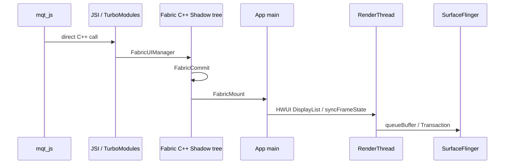

# React Native New Arch (Fabric + JSI) 渲染管线

RN 新架构基于 Fabric 渲染器、JSI 和 TurboModules：JS 线程通过 JSI 直接调用 C++，Fabric C++ Shadow tree 负责 commit/mount，最终仍把原生 View 更新提交给宿主 HWUI RenderThread 出图。

| 线程名称 | 关键职责 | 常见 Trace 标签 |
|---|---|---|
| mqt_js | 执行 React 业务逻辑与 JSI 调用 | JSI, TurboModule, Hermes |
| Fabric background thread | Fabric Shadow tree、commit、diff | FabricUIManager, FabricCommit |
| main | Fabric mount、原生 View 创建/更新、宿主 View 绘制 | FabricMount, Choreographer#doFrame |
| RenderThread | 宿主 HWUI GPU 命令提交 | DrawFrame, syncFrameState, queueBuffer |

## 关键 Slice

- `FabricUIManager`：Fabric UI manager 入口。
- `FabricCommit` / `FabricMount`：Fabric 原子提交和 mount View 更新。
- `JSI`：JS 到 C++ 的直接调用路径。
- `TurboModule`：TurboModule 同步或异步 native 调用。

## 观察重点

- Fabric 降低了 Bridge 序列化开销，但 JS 线程阻塞仍会影响 UI。
- Fabric mount 通常在 main thread 体现，大量 View 同帧 mount 仍可能超 budget。
- TurboModule 同步调用可能让 JS 等待 native 完成。
- 新架构比 Old Arch 延迟更低，但是否真正命中 Fabric/JSI 要看当前 trace 的实际 slice。
