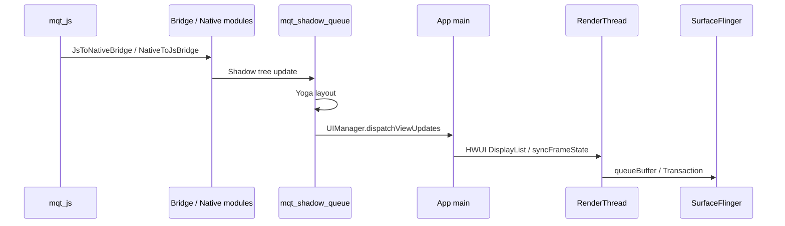

# React Native Old Arch (Paper + Bridge) 渲染管线

RN 老架构基于 Paper 渲染器和 Bridge：JS 线程执行 React 业务逻辑，Bridge 通过序列化跨 JS/Native 边界，Shadow thread 做 Yoga layout，UIManager 在 main thread 创建或更新原生 View，最终回到宿主 HWUI RenderThread 出图。

| 线程名称 | 关键职责 | 常见 Trace 标签 |
|---|---|---|
| mqt_js | 执行 React 业务逻辑、状态更新、JS 动画 driver | JS call, Hermes, JSC, NativeToJsBridge |
| mqt_native_modules | Native module 调用与 Bridge 分发 | JsToNativeBridge, NativeModule |
| mqt_shadow_queue | Shadow tree 更新和 Yoga layout | Yoga, layout |
| main | 创建/更新原生 View，并进入宿主 View 绘制 | UIManager.dispatchViewUpdates, Choreographer#doFrame |
| RenderThread | 宿主 HWUI GPU 命令提交 | DrawFrame, syncFrameState, queueBuffer |

## 关键 Slice

- `Yoga`：Shadow thread 上的 flexbox 布局计算。
- `NativeToJsBridge` / `JsToNativeBridge`：JS 与 Native 间的 Bridge 调用。
- `UIManager.dispatchViewUpdates`：将 RN View 更新提交到 Android View 系统。
- `Choreographer#doFrame`、`DrawFrame`、`syncFrameState`：回到宿主 HWUI 后的标准出图链路。

## 观察重点

- JS 线程阻塞会拖慢后续 UI 更新，表现为 mqt_js 上长任务或 GC pause。
- Bridge 高频小粒度调用会产生序列化与调度开销。
- 深嵌套 View 树或复杂 flex 规则会让 Yoga layout 放大。
- RN Old Arch 的 UI 更新通常可能落后 1-2 帧；以 trace 中的 JS、Shadow、main、RenderThread 时间关系为准。
