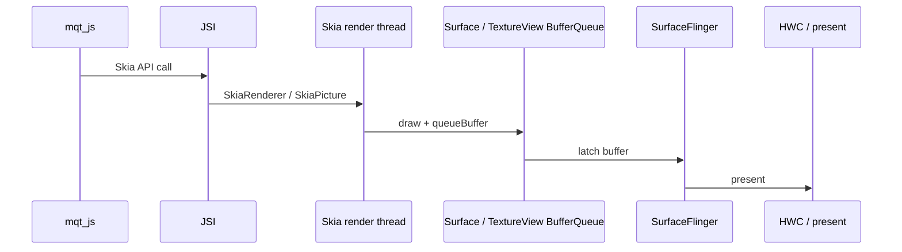

# React Native Skia 渲染管线

React Native Skia 通常通过 JSI 让 JS 直接驱动 Skia C++ 绘制。它不一定走宿主 HWUI RenderThread，而是可能使用独立 Surface 或 TextureView 输出，更接近 OpenGL/Vulkan 这类应用自绘管线。

| 线程名称 | 关键职责 | 常见 Trace 标签 |
|---|---|---|
| mqt_js | 发起 Skia 绘制指令、动画状态更新 | JSI, react-native-skia |
| Skia render thread | Skia path、shader、picture 绘制 | SkiaRenderer, SkiaPicture, SkCanvas |
| Surface / TextureView producer | 提交自绘 buffer | queueBuffer, dequeueBuffer |
| SurfaceFlinger / HWC | 合成与上屏 | latchBuffer, present, HWC |

## 关键 Slice

- `SkiaRenderer` / `SkiaPicture`：Skia 绘制入口或 picture replay。
- `react-native-skia`：库相关调用路径。
- `queueBuffer` / `dequeueBuffer`：独立 Surface 或 TextureView 的 BufferQueue 交换。
- `present` / `HWC`：最终显示提交。

## 观察重点

- 复杂 path、shader、blend mode 会让 Skia draw 阶段变重。
- JSI 同步调用过多会把 JS 线程和 Skia 绘制耦合起来。
- 独立 Surface/TextureView 链路需要单独看 producer、BufferQueue、SurfaceFlinger 和 present，不应只看宿主 HWUI。
- 如果 trace 里没有 Skia 或独立 Surface 证据，只能说明 RN Skia 未被当前采集窗口观测到，不能凭模板认定存在。
